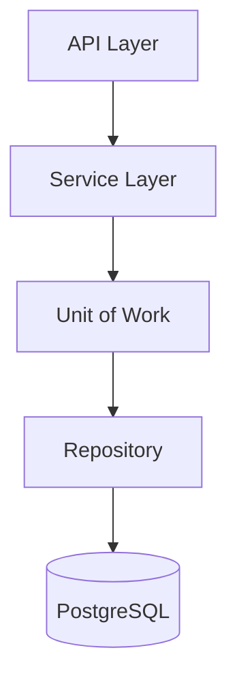
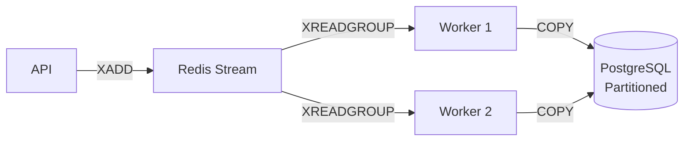
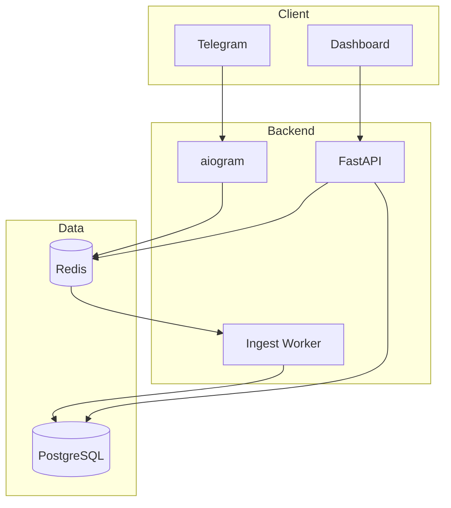

# История Проекта TMS

> **Transportation Management System** — система управления транспортом с real-time отслеживанием водителей

📅 **Период разработки:** 26.12.2025 — 31.12.2025  
👤 **Автор:** SmolaGen  
🌐 **Домен:** https://myappnf.ru

---

## Обзор

TMS — полнофункциональная система для управления водителями и заказами с:
- Real-time геолокацией через Telegram Live Location
- Интерактивным Dashboard с картой и таймлайном
- High-throughput ingestion (10-50k записей/сек)

---

## Хронология разработки

### 📅 День 1: 26 декабря 2025

---

#### Коммит 1: `996c6ec`
**feat(tms): Инициализация TMS инфраструктуры**

Создана базовая структура проекта (+1632 строки):

| Категория | Файлы | Технологии |
|-----------|-------|------------|
| API | `src/main.py`, `src/config.py` | FastAPI |
| Database | `src/database/`, `alembic/` | SQLAlchemy 2.x, PostgreSQL + PostGIS |
| Infrastructure | `Dockerfile`, `docker-compose.yml` | Docker |
| Tests | `tests/` | pytest |

```python
# src/main.py
from fastapi import FastAPI
app = FastAPI(title="TMS API")

@app.on_event("startup")
async def startup():
    # Подключение к PostgreSQL и Redis
    pass
```

---

#### Коммит 2: `4778937`
**feat: implement Repository, UoW and Service Layer**

Реализованы архитектурные паттерны (+288 строк):



```python
# src/services/driver_service.py
class DriverService:
    def __init__(self, uow: SQLAlchemyUnitOfWork):
        self.uow = uow
    
    async def register_driver(self, data: DriverCreate) -> Driver:
        async with self.uow:
            driver = Driver(**data.model_dump())
            await self.uow.drivers.add(driver)
            await self.uow.commit()
            return driver
```

---

#### Коммиты 3-4: `73d30f5`, `5b39e1d`
**feat(tms): API Layer & Real-time Location Processing**

Добавлены REST endpoints и Redis Streams (+809 строк):

| Endpoint | Описание |
|----------|----------|
| `POST /orders` | Создание заказа |
| `GET /drivers/live` | Текущие локации |
| `PATCH /orders/{id}/move` | Перемещение заказа |

```python
# src/services/location_manager.py
class LocationManager:
    async def push_location(self, driver_id: str, lat: float, lon: float):
        await self.redis.xadd(
            "driver:locations",
            {"driver_id": driver_id, "lat": lat, "lon": lon},
            maxlen=100000
        )
```

---

### 📅 День 2: 27 декабря 2025

---

#### Коммит 5: `618fa69`
**feat: implement driver telegram bot integration**

Интеграция Telegram Bot на aiogram 3.x (+384 строки):

```
src/bot/
├── handlers/location.py   # Live Location
├── handlers/orders.py     # /orders WebApp
└── middlewares/auth.py    # AuthMiddleware
```

```python
# src/bot/handlers/location.py
@router.message(F.location)
async def handle_location(message: Message, driver: Driver):
    await location_manager.push_location(
        driver_id=str(driver.id),
        lat=message.location.latitude,
        lon=message.location.longitude
    )
```

---

#### Коммит 6: `7971efe`
**feat(frontend): Dashboard TMS с LiveMap и TimelineView**

Полный React фронтенд (+4432 строки):

| Технология | Назначение |
|------------|------------|
| React 18 + TypeScript | UI Framework |
| Vite 5 | Build tool |
| TanStack Query | Data Fetching + Optimistic UI |
| Zustand | State Management + WebSocket |
| Leaflet | Карта с маркерами |
| vis-timeline | Drag-n-Drop таймлайн |

```typescript
// src/hooks/useOrders.ts — Optimistic UI
export const useMoveOrder = () => {
  return useMutation({
    onMutate: async ({ id, data }) => {
      const previous = queryClient.getQueryData(['orders']);
      queryClient.setQueryData(['orders'], (old: Order[]) =>
        old.map(o => o.id === id ? { ...o, ...data } : o)
      );
      return { previous };
    },
    onError: (err, _, context) => {
      queryClient.setQueryData(['orders'], context?.previous); // Rollback
    },
  });
};
```

---

#### Коммит 7: `8935d9d`
**feat(ingestion): High-Throughput Data Ingestion**

Consumer Groups + PostgreSQL COPY (+665 строк):



| Метод | Производительность |
|-------|-------------------|
| INSERT | ~1k/sec |
| **COPY** | **~50k/sec** |

```python
# src/workers/ingest_worker.py
async def _process_batch(self, messages):
    buffer = io.StringIO()
    for msg_id, data in messages:
        buffer.write(f"{data['driver_id']}\t{data['lat']}\t{data['lon']}\n")
    
    await cur.copy("COPY driver_location_history FROM STDIN", buffer)
    await self.redis.xack("driver:locations", self.CONSUMER_GROUP, *msg_ids)
```

---

### 📅 День 3: 28 декабря 2025

---

#### Коммиты 8-9: `2c7a665`, `88965b2`
**feat: Driver CRUD endpoints**

REST API для управления водителями (+140 строк):

```python
@router.get("/drivers", response_model=list[DriverRead])
async def get_drivers(service: DriverService = Depends(get_driver_service)):
    return await service.get_all()

@router.post("/drivers", response_model=DriverRead, status_code=201)
async def create_driver(data: DriverCreate, service: DriverService = Depends()):
    return await service.register_driver(data)
```

---

#### Коммит 10: `dec86f7`
**Заполнен openspec/project.md**

Документация проекта: Tech Stack, Architecture Patterns, Domain Context.

---

#### Коммит 11: `dbec0d5`
**feat: Production readiness — Security Hardening**

Безопасность и Nginx (+611 строк):

| Компонент | Реализация |
|-----------|------------|
| CORS | Конкретные домены вместо `*` |
| Rate Limiting | SlowAPI + Redis (30 req/min для GPS) |
| Nginx | SSL, Gzip, WebSocket proxy |

```python
# Rate Limiting
@app.post("/drivers/{id}/location")
@limiter.limit("30/minute")
async def update_location(...):
    pass
```

---

#### Коммит 12: `7de9b09`
**fix: Enum PostgreSQL compatibility**

Фикс lowercase значений Enum для PostgreSQL.

---

### 📅 День 4: 31 декабря 2025

---

#### Коммит 13: `38b44b0` (HEAD)
**Initial commit: TMS project**

Финализация Dashboard, удаление временных файлов.

---

## Стек технологий

### Backend

| Технология | Версия | Файлы |
|------------|--------|-------|
| FastAPI | ≥0.100 | [main.py](file:///Users/alsmolentsev/tms_new/src/main.py) |
| SQLAlchemy | 2.x | [database/](file:///Users/alsmolentsev/tms_new/src/database) |
| aiogram | 3.x | [bot/](file:///Users/alsmolentsev/tms_new/src/bot) |
| Redis Streams | 7+ | [location_manager.py](file:///Users/alsmolentsev/tms_new/src/services/location_manager.py) |
| PostgreSQL + PostGIS | 15+ | [models.py](file:///Users/alsmolentsev/tms_new/src/database/models.py) |

### Frontend

| Технология | Версия | Файлы |
|------------|--------|-------|
| React | 18.x | [frontend/src/](file:///Users/alsmolentsev/tms_new/frontend/src) |
| TanStack Query | 5.x | [hooks/](file:///Users/alsmolentsev/tms_new/frontend/src/hooks) |
| Zustand | 4.x | [stores/](file:///Users/alsmolentsev/tms_new/frontend/src/stores) |
| Leaflet | 1.9 | [LiveMap.tsx](file:///Users/alsmolentsev/tms_new/frontend/src/components/dashboard/LiveMap.tsx) |

---

## Архитектура



---

## Статистика

| Метрика | Значение |
|---------|----------|
| Всего коммитов | 13 |
| Дней разработки | 4 |
| Строк кода добавлено | ~10,000+ |
| Файлов создано | ~80 |
