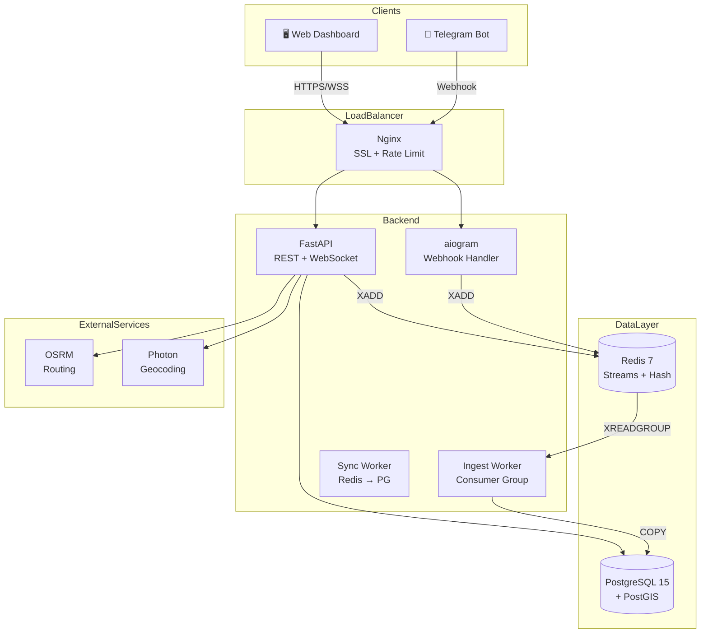
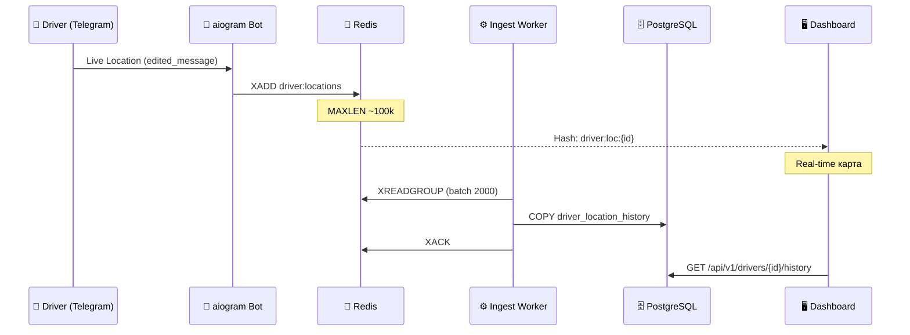
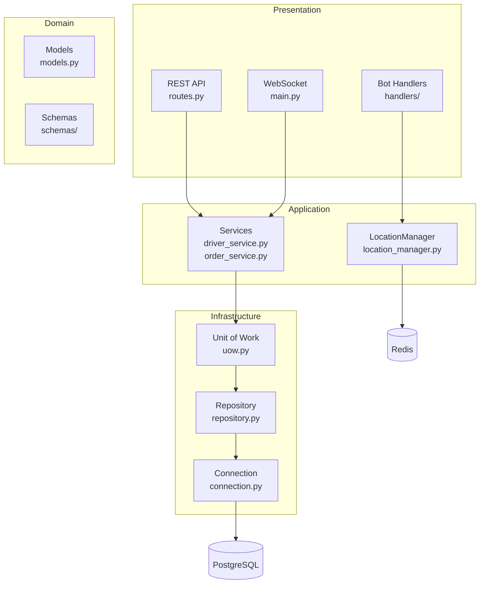
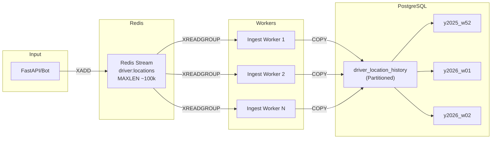

# История Проекта TMS — Полная Документация

> **Transportation Management System** — система управления транспортом с real-time отслеживанием водителей

📅 **Период разработки:** 26 декабря 2025 — 6 января 2026  
👤 **Автор:** SmolaGen (alsmolentsev98@gmail.com)  
🌐 **Продакшен домен:** https://myappnf.ru  
📊 **Статистика:** 30+ коммитов, ~15,000+ строк кода, 12 дней разработки

---

## Оглавление

1. [Обзор проекта](#обзор-проекта)
2. [Технологический стек](#технологический-стек)
3. [Архитектура системы](#архитектура-системы)
4. [Хронология разработки](#хронология-разработки)
   - [День 1: 26 декабря 2025](#-день-1-26-декабря-2025)
   - [День 2: 27 декабря 2025](#-день-2-27-декабря-2025)
   - [День 3: 28 декабря 2025](#-день-3-28-декабря-2025)
   - [День 4: 31 декабря 2025](#-день-4-31-декабря-2025)
   - [День 5-8: 4-6 января 2026 - Stats, Infra & Real-time](#-день-5-8-4-6-января-2026---stats-infra--real-time)
5. [API Reference](#api-reference)
6. [Подробные реализации](#подробные-реализации)

---

## Обзор проекта

TMS (Transportation Management System) — это современная система управления транспортом, разработанная для:

### Основные функции

| Функция | Описание | Технология |
|---------|----------|------------|
| **Real-time отслеживание** | Получение GPS-координат водителей через Telegram Live Location | aiogram 3.x + Redis Streams |
| **Управление заказами** | CRUD операции с проверкой пересечения времени | FastAPI + PostgreSQL Exclusion Constraints |
| **Интерактивный Dashboard** | Карта с маркерами и Drag-n-Drop таймлайн | React + Leaflet + vis-timeline |
| **High-Throughput Ingestion** | Запись 10-50k локаций/сек в PostgreSQL | Redis Consumer Groups + COPY |

### Бизнес-правила

1. **Exclusion Constraints** — один водитель не может иметь пересекающиеся по времени заказы (проверка на уровне БД)
2. **Live Location TTL** — координаты водителя считаются устаревшими через 5 минут
3. **Rate Limiting** — GPS endpoint ограничен 30 запросами/минуту для защиты от спама

---

## Технологический стек

### Backend Stack

| Категория | Технология | Версия | Назначение |
|-----------|------------|--------|------------|
| **Framework** | FastAPI | ≥0.100 | Async REST API + WebSocket |
| **ORM** | SQLAlchemy | 2.x | Async ORM с declarative style |
| **Database** | PostgreSQL | 15+ | Основная БД |
| **GIS** | PostGIS | 3.x | Геопространственные операции |
| **Cache/Queue** | Redis | 7+ | Streams, Hash, Set |
| **Bot** | aiogram | 3.x | Telegram Bot Framework |
| **Security** | SlowAPI | 0.1.9 | Rate Limiting |
| **Logging** | structlog | — | Structured JSON logging |
| **Migrations** | Alembic | — | Database migrations |

### Frontend Stack

| Категория | Технология | Версия | Назначение |
|-----------|------------|--------|------------|
| **Framework** | React | 18.x | UI Framework |
| **Language** | TypeScript | 5.x | Type safety |
| **Build** | Vite | 5.x | Сборка и dev server |
| **State** | TanStack Query | 5.x | Data Fetching + Optimistic UI |
| **State** | Zustand | 4.x | WebSocket State Management |
| **Map** | Leaflet | 1.9 | Интерактивная карта |
| **Timeline** | vis-timeline | 7.x | Drag-n-Drop таймлайн |
| **UI** | Ant Design | 5.x | Компонентная библиотека |

### Infrastructure

| Компонент | Технология | Назначение |
|-----------|------------|------------|
| **Containers** | Docker Compose | Оркестрация сервисов |
| **Reverse Proxy** | Nginx | SSL termination, gzip |
| **SSL** | Let's Encrypt | Автообновление сертификатов |
| **Process Manager** | PM2 | Production process управление |
| **Routing** | OSRM | Маршрутизация (Приморский край) |
| **Geocoding** | Photon | Поиск адресов |

---

## Архитектура системы

### High-Level Architecture



### Data Flow: GPS Location



### Clean Architecture Layers



---

## Хронология разработки

---

### 📅 День 1: 26 декабря 2025

В первый день была создана полная backend инфраструктура проекта.

---

#### Коммит 1: `996c6ec6c489794146b26fd389d64493bcf1706b`

📝 **Сообщение:** `feat(tms): Инициализация TMS инфраструктуры`  
📅 **Дата:** 2025-12-26 06:54:47 +1000  
📊 **Статистика:** 19 файлов, +1632 строки

##### Созданные файлы

| Категория | Файлы | Описание |
|-----------|-------|----------|
| **Configuration** | `.env.example`, `.gitignore` | Переменные окружения |
| **Docker** | `Dockerfile`, `docker-compose.yml` | Контейнеризация |
| **Database** | `alembic/`, `src/database/` | Миграции и модели |
| **API** | `src/main.py`, `src/config.py` | FastAPI приложение |
| **Tests** | `tests/` | pytest конфигурация |

##### Docker Compose Services

```yaml
# docker-compose.yml (основные сервисы)
services:
  postgres:
    image: postgis/postgis:15-3.3-alpine
    environment:
      POSTGRES_DB: tms
      POSTGRES_USER: tms
      POSTGRES_PASSWORD: ${DB_PASSWORD}
    volumes:
      - postgres_data:/var/lib/postgresql/data
    ports:
      - "5433:5432"  # Изменён порт для избежания конфликтов

  redis:
    image: redis:7-alpine
    command: redis-server --appendonly yes
    volumes:
      - redis_data:/data

  osrm:
    image: ghcr.io/project-osrm/osrm-backend
    volumes:
      - ./osrm-data:/data
    command: osrm-routed --algorithm mld /data/primorsky-krai.osrm
    profiles: ["routing"]

  photon:
    image: komoot/photon:latest
    volumes:
      - ./photon-data:/photon/photon_data
    profiles: ["geocoding"]
```

##### Модели данных (SQLAlchemy 2.0)

**Полный код `src/database/models.py`:**

```python
"""
TMS Database Models

Модели данных для системы управления транспортом.
Использует SQLAlchemy 2.0 с декларативным стилем и GeoAlchemy2.
"""

from datetime import datetime
from enum import Enum as PyEnum
from typing import Optional

from geoalchemy2 import Geometry
from sqlalchemy import (
    BigInteger,
    CheckConstraint,
    Enum,
    ForeignKey,
    Index,
    String,
    Text,
    text,
)
from sqlalchemy.dialects.postgresql import TSTZRANGE
from sqlalchemy.orm import DeclarativeBase, Mapped, mapped_column, relationship


class Base(DeclarativeBase):
    """Базовый класс для всех моделей."""
    pass


class DriverStatus(str, PyEnum):
    """Статусы водителя."""
    AVAILABLE = "available"      # Доступен для заказов
    BUSY = "busy"                # Занят (выполняет заказ)
    OFFLINE = "offline"          # Не на связи


class OrderStatus(str, PyEnum):
    """Статусы заказа."""
    PENDING = "pending"          # Ожидает назначения водителя
    ASSIGNED = "assigned"        # Назначен водитель
    IN_PROGRESS = "in_progress"  # Выполняется
    COMPLETED = "completed"      # Завершён
    CANCELLED = "cancelled"      # Отменён


class OrderPriority(str, PyEnum):
    """Приоритет заказа."""
    LOW = "low"
    NORMAL = "normal"
    HIGH = "high"
    URGENT = "urgent"


class Driver(Base):
    """
    Модель водителя.
    
    Attributes:
        id: Первичный ключ
        telegram_id: Уникальный идентификатор в Telegram
        name: Имя водителя
        phone: Номер телефона
        status: Текущий статус водителя
        created_at: Дата создания записи
        updated_at: Дата последнего обновления
        is_active: Флаг активности (разрешен ли вход в бот)
    """
    __tablename__ = "drivers"
    
    id: Mapped[int] = mapped_column(primary_key=True, autoincrement=True)
    telegram_id: Mapped[int] = mapped_column(
        BigInteger, 
        unique=True, 
        index=True,
        comment="Telegram user ID"
    )
    name: Mapped[str] = mapped_column(
        String(255),
        comment="Имя водителя"
    )
    phone: Mapped[Optional[str]] = mapped_column(
        String(20),
        nullable=True,
        comment="Номер телефона"
    )
    status: Mapped[DriverStatus] = mapped_column(
        Enum(DriverStatus, name="driver_status", 
             values_callable=lambda x: [e.value for e in x]),
        default=DriverStatus.OFFLINE,
        server_default=text("'offline'"),
        comment="Текущий статус"
    )
    created_at: Mapped[datetime] = mapped_column(
        default=datetime.utcnow,
        server_default=text("CURRENT_TIMESTAMP")
    )
    updated_at: Mapped[datetime] = mapped_column(
        default=datetime.utcnow,
        server_default=text("CURRENT_TIMESTAMP"),
        onupdate=datetime.utcnow
    )
    is_active: Mapped[bool] = mapped_column(
        default=True,
        server_default=text("true"),
        comment="Флаг активности (разрешен ли вход в бот)"
    )
    
    # Relationships
    orders: Mapped[list["Order"]] = relationship(
        "Order",
        back_populates="driver",
        lazy="selectin"
    )
    
    def __repr__(self) -> str:
        return f"<Driver(id={self.id}, name='{self.name}', status={self.status.value})>"


class Order(Base):
    """
    Модель заказа.
    
    Note:
        Exclusion Constraint `no_driver_time_overlap` гарантирует,
        что один водитель не может иметь пересекающиеся по времени заказы.
    """
    __tablename__ = "orders"
    
    id: Mapped[int] = mapped_column(primary_key=True, autoincrement=True)
    driver_id: Mapped[Optional[int]] = mapped_column(
        ForeignKey("drivers.id", ondelete="SET NULL"),
        nullable=True,
        index=True,
        comment="FK на водителя"
    )
    status: Mapped[OrderStatus] = mapped_column(
        Enum(OrderStatus, name="order_status",
             values_callable=lambda x: [e.value for e in x]),
        default=OrderStatus.PENDING,
        server_default=text("'pending'"),
        comment="Статус заказа"
    )
    priority: Mapped[OrderPriority] = mapped_column(
        Enum(OrderPriority, name="order_priority",
             values_callable=lambda x: [e.value for e in x]),
        default=OrderPriority.NORMAL,
        server_default=text("'normal'"),
        comment="Приоритет заказа"
    )
    
    pickup_location: Mapped[Optional[str]] = mapped_column(
        Geometry(geometry_type="POINT", srid=4326),
        nullable=True,
        comment="Координаты точки погрузки (WGS84)"
    )
    dropoff_location: Mapped[Optional[str]] = mapped_column(
        Geometry(geometry_type="POINT", srid=4326),
        nullable=True,
        comment="Координаты точки выгрузки (WGS84)"
    )
    
    comment: Mapped[Optional[str]] = mapped_column(
        Text,
        nullable=True,
        comment="Комментарий к заказу"
    )
    
    created_at: Mapped[datetime] = mapped_column(
        default=datetime.utcnow,
        server_default=text("CURRENT_TIMESTAMP")
    )
    updated_at: Mapped[datetime] = mapped_column(
        default=datetime.utcnow,
        server_default=text("CURRENT_TIMESTAMP"),
        onupdate=datetime.utcnow
    )
    
    # Relationships
    driver: Mapped[Optional["Driver"]] = relationship(
        "Driver",
        back_populates="orders",
        lazy="joined"
    )
    
    __table_args__ = (
        Index("ix_orders_status_priority", "status", "priority"),
    )


class DriverLocationHistory(Base):
    """
    История перемещений водителя.
    
    Используется фоновым воркером для пакетной записи координат из Redis.
    """
    __tablename__ = "driver_location_history"
    
    id: Mapped[int] = mapped_column(primary_key=True, autoincrement=True)
    driver_id: Mapped[int] = mapped_column(
        ForeignKey("drivers.id", ondelete="CASCADE"),
        index=True,
        comment="ID водителя"
    )
    location: Mapped[str] = mapped_column(
        Geometry(geometry_type="POINT", srid=4326),
        comment="Координаты (WGS84)"
    )
    recorded_at: Mapped[datetime] = mapped_column(
        index=True,
        comment="Время фиксации координат водителем"
    )
    created_at: Mapped[datetime] = mapped_column(
        default=datetime.utcnow,
        server_default=text("CURRENT_TIMESTAMP"),
        comment="Время записи в БД"
    )
    
    driver: Mapped["Driver"] = relationship("Driver", backref="location_history")
    
    __table_args__ = (
        Index("ix_driver_location_time", "driver_id", "recorded_at"),
    )
```

##### Alembic Migration: Exclusion Constraint

```python
# alembic/versions/001_initial.py

def upgrade():
    # Создание расширений
    op.execute("CREATE EXTENSION IF NOT EXISTS btree_gist")
    op.execute("CREATE EXTENSION IF NOT EXISTS postgis")
    
    # Создание таблиц...
    
    # Exclusion Constraint для предотвращения пересечения заказов
    op.execute("""
        ALTER TABLE orders 
        ADD CONSTRAINT no_driver_time_overlap 
        EXCLUDE USING GIST (
            driver_id WITH =,
            time_range WITH &&
        )
        WHERE (status NOT IN ('completed', 'cancelled'))
    """)
```

##### Unit-тесты: Order Overlap

```python
# tests/test_order_overlap.py

import pytest
from sqlalchemy.exc import IntegrityError

@pytest.mark.asyncio
async def test_overlapping_orders_raises_integrity_error(session, driver):
    """Пересекающиеся заказы для одного водителя должны вызывать ошибку."""
    order1 = Order(
        driver_id=driver.id,
        time_range="[2025-12-26 10:00, 2025-12-26 12:00)",
        status=OrderStatus.ASSIGNED
    )
    session.add(order1)
    await session.commit()
    
    order2 = Order(
        driver_id=driver.id,
        time_range="[2025-12-26 11:00, 2025-12-26 13:00)",  # Пересекается!
        status=OrderStatus.ASSIGNED
    )
    session.add(order2)
    
    with pytest.raises(IntegrityError) as exc:
        await session.commit()
    
    assert "no_driver_time_overlap" in str(exc.value)


@pytest.mark.asyncio
async def test_adjacent_orders_allowed(session, driver):
    """Смежные заказы (без пересечения) разрешены."""
    order1 = Order(
        driver_id=driver.id,
        time_range="[2025-12-26 10:00, 2025-12-26 12:00)",
        status=OrderStatus.ASSIGNED
    )
    order2 = Order(
        driver_id=driver.id,
        time_range="[2025-12-26 12:00, 2025-12-26 14:00)",  # Начинается сразу после
        status=OrderStatus.ASSIGNED
    )
    
    session.add_all([order1, order2])
    await session.commit()  # Должно пройти без ошибок
    
    assert order1.id is not None
    assert order2.id is not None


@pytest.mark.asyncio
async def test_different_drivers_overlapping_allowed(session, driver1, driver2):
    """Пересекающиеся заказы для РАЗНЫХ водителей разрешены."""
    order1 = Order(
        driver_id=driver1.id,
        time_range="[2025-12-26 10:00, 2025-12-26 12:00)",
        status=OrderStatus.ASSIGNED
    )
    order2 = Order(
        driver_id=driver2.id,  # Другой водитель
        time_range="[2025-12-26 10:00, 2025-12-26 12:00)",  # То же время
        status=OrderStatus.ASSIGNED
    )
    
    session.add_all([order1, order2])
    await session.commit()  # OK


@pytest.mark.asyncio
async def test_completed_order_allows_overlap(session, driver):
    """Завершённый заказ не блокирует новые заказы в то же время."""
    order1 = Order(
        driver_id=driver.id,
        time_range="[2025-12-26 10:00, 2025-12-26 12:00)",
        status=OrderStatus.COMPLETED  # Завершён!
    )
    order2 = Order(
        driver_id=driver.id,
        time_range="[2025-12-26 10:00, 2025-12-26 12:00)",
        status=OrderStatus.ASSIGNED
    )
    
    session.add_all([order1, order2])
    await session.commit()  # OK, constraint игнорирует completed
```

---

#### Коммит 2: `4778937e9b492b7ee721c6164211f655eace991a`

📝 **Сообщение:** `feat: implement Repository, UoW and Service Layer for Driver management`  
📅 **Дата:** 2025-12-26 07:30:32 +1000  
📊 **Статистика:** 8 файлов, +288 строк

##### Архитектурные паттерны

Реализованы три ключевых паттерна Clean Architecture:

1. **Repository Pattern** — абстракция доступа к данным
2. **Unit of Work** — управление транзакциями
3. **Service Layer** — бизнес-логика

##### Repository Pattern

**Полный код `src/database/repository.py`:**

```python
from abc import ABC, abstractmethod
from typing import Generic, TypeVar, Type, Sequence, Optional
from sqlalchemy import select, update, delete
from sqlalchemy.ext.asyncio import AsyncSession
from src.database.models import Base

T = TypeVar("T", bound=Base)


class AbstractRepository(ABC, Generic[T]):
    """Абстрактный репозиторий с базовыми CRUD операциями."""
    
    @abstractmethod
    def add(self, entity: T) -> T:
        raise NotImplementedError

    @abstractmethod
    async def get(self, id: int) -> Optional[T]:
        raise NotImplementedError

    @abstractmethod
    async def get_all(self) -> Sequence[T]:
        raise NotImplementedError
    
    @abstractmethod
    async def get_by_attribute(self, attr_name: str, value: any) -> Optional[T]:
        raise NotImplementedError

    @abstractmethod
    async def delete(self, id: int) -> bool:
        raise NotImplementedError


class SQLAlchemyRepository(AbstractRepository[T]):
    """Конкретная реализация репозитория для SQLAlchemy."""
    
    def __init__(self, session: AsyncSession, model: Type[T]):
        self.session = session
        self.model = model

    def add(self, entity: T) -> T:
        """Добавляет сущность в сессию (не коммитит)."""
        self.session.add(entity)
        return entity

    async def get(self, id: int) -> Optional[T]:
        """Получает сущность по ID."""
        query = select(self.model).filter_by(id=id)
        result = await self.session.execute(query)
        return result.scalar_one_or_none()

    async def get_all(self) -> Sequence[T]:
        """Получает все сущности."""
        query = select(self.model)
        result = await self.session.execute(query)
        return result.scalars().all()

    async def get_by_attribute(self, attr_name: str, value: any) -> Optional[T]:
        """Поиск по произвольному атрибуту."""
        query = select(self.model).filter(getattr(self.model, attr_name) == value)
        result = await self.session.execute(query)
        return result.scalar_one_or_none()

    async def delete(self, id: int) -> bool:
        """Удаляет сущность по ID."""
        query = delete(self.model).where(self.model.id == id)
        result = await self.session.execute(query)
        return result.rowcount > 0
```

##### Unit of Work Pattern

**Полный код `src/database/uow.py`:**

```python
from abc import ABC, abstractmethod
from sqlalchemy.ext.asyncio import AsyncSession
from src.database.connection import async_session_factory
from src.database.repository import SQLAlchemyRepository
from src.database.models import Driver, Order


class AbstractUnitOfWork(ABC):
    """Абстрактный Unit of Work для управления транзакциями."""
    drivers: SQLAlchemyRepository[Driver]
    orders: SQLAlchemyRepository[Order]

    async def __aenter__(self):
        return self

    async def __aexit__(self, exc_type, exc_val, exc_tb):
        await self.rollback()

    @abstractmethod
    async def commit(self):
        raise NotImplementedError

    @abstractmethod
    async def rollback(self):
        raise NotImplementedError


class SQLAlchemyUnitOfWork(AbstractUnitOfWork):
    """
    Конкретная реализация UoW для SQLAlchemy.
    
    Использование:
        async with SQLAlchemyUnitOfWork() as uow:
            driver = await uow.drivers.get(1)
            driver.name = "New Name"
            await uow.commit()  # Автоматически при выходе без ошибок
    """
    
    def __init__(self, session_factory=async_session_factory):
        self.session_factory = session_factory

    async def __aenter__(self):
        self.session: AsyncSession = self.session_factory()
        self.drivers = SQLAlchemyRepository(self.session, Driver)
        self.orders = SQLAlchemyRepository(self.session, Order)
        return await super().__aenter__()

    async def __aexit__(self, exc_type, exc_val, exc_tb):
        if exc_type:
            await self.rollback()
        else:
            await self.commit()
        await self.session.close()

    async def commit(self):
        await self.session.commit()

    async def rollback(self):
        await self.session.rollback()
```

##### Service Layer

**Полный код `src/services/driver_service.py`:**

```python
from typing import List, Optional
from src.database.uow import AbstractUnitOfWork
from src.database.models import Driver, DriverStatus
from src.schemas.driver import DriverCreate, DriverResponse, DriverUpdate


class DriverService:
    """
    Сервис для управления водителями.
    
    Инкапсулирует бизнес-логику, не зависит от фреймворка.
    """
    
    def __init__(self, uow: AbstractUnitOfWork):
        self.uow = uow

    async def register_driver(self, data: DriverCreate) -> DriverResponse:
        """
        Регистрация нового водителя.
        
        Raises:
            ValueError: Если telegram_id уже существует
        """
        async with self.uow:
            # Проверка уникальности telegram_id
            existing = await self.uow.drivers.get_by_attribute(
                "telegram_id", data.telegram_id
            )

##### Zustand WebSocket Store

**Полный код `frontend/src/stores/useWebSocketStore.ts`:**

```typescript
import { create } from 'zustand';

interface WebSocketState {
    socket: WebSocket | null;
    isConnected: boolean;
    reconnectAttempts: number;
    connect: () => void;
    disconnect: () => void;
    addMessageHandler: (handler: (event: MessageEvent) => void) => void;
    removeMessageHandler: (handler: (event: MessageEvent) => void) => void;
}

const MAX_RECONNECT_ATTEMPTS = 10;
const BASE_DELAY_MS = 1000;

// Обработчики вне состояния для избежания re-renders
const messageHandlers = new Set<(event: MessageEvent) => void>();

export const useWebSocketStore = create<WebSocketState>((set, get) => ({
    socket: null,
    isConnected: false,
    reconnectAttempts: 0,

    connect: () => {
        const wsUrl = import.meta.env.VITE_WS_URL || 'ws://localhost:8000/ws';
        const ws = new WebSocket(wsUrl);

        ws.onopen = () => {
            console.log('[WS] Connected');
            set({ socket: ws, isConnected: true, reconnectAttempts: 0 });
        };

        ws.onmessage = (event) => {
            // Вызываем все зарегистрированные обработчики
            messageHandlers.forEach((handler) => handler(event));
        };

        ws.onclose = () => {
            set({ isConnected: false });

            const { reconnectAttempts } = get();
            if (reconnectAttempts < MAX_RECONNECT_ATTEMPTS) {
                // Экспоненциальная задержка: 1s, 2s, 4s, 8s...
                const delay = BASE_DELAY_MS * Math.pow(2, reconnectAttempts);
                console.log(`[WS] Reconnecting in ${delay}ms (attempt ${reconnectAttempts + 1})`);

                setTimeout(() => {
                    set({ reconnectAttempts: reconnectAttempts + 1 });
                    get().connect();
                }, delay);
            } else {
                console.error('[WS] Max reconnect attempts reached');
            }
        };

        ws.onerror = (error) => {
            console.error('[WS] Error:', error);
        };

        set({ socket: ws });
    },

    disconnect: () => {
        const { socket } = get();
        if (socket) {
            socket.close();
            set({ socket: null, isConnected: false, reconnectAttempts: 0 });
        }
    },

    addMessageHandler: (handler) => {
        messageHandlers.add(handler);
    },

    removeMessageHandler: (handler) => {
        messageHandlers.delete(handler);
    },
}));
```

##### TanStack Query: Optimistic UI

**Полный код `frontend/src/hooks/useOrders.ts`:**

```typescript
import { useQuery, useMutation, useQueryClient } from '@tanstack/react-query';
import { notification } from 'antd';
import { useRef, useCallback } from 'react';
import { fetchOrders, moveOrder } from '../api/orders';
import type { OrderResponse, TimelineOrder, OrderMoveRequest } from '../types/api';

// Преобразование API ответа в формат Timeline
const toTimelineOrder = (order: OrderResponse): TimelineOrder | null => {
    if (!order.time_start || !order.time_end) return null;

    return {
        id: String(order.id),
        group: order.driver_id ? String(order.driver_id) : 'unassigned',
        content: `Заказ #${order.id}`,
        start: new Date(order.time_start),
        end: new Date(order.time_end),
        className: `order-${order.priority}`,
        editable: order.status !== 'completed' && order.status !== 'cancelled',
    };
};

export const useOrders = (dateRange?: [Date, Date]) => {
    return useQuery({
        queryKey: ['orders', dateRange?.map(d => d.toISOString())],
        queryFn: () => fetchOrders(dateRange),
        select: (data) => data.map(toTimelineOrder).filter(Boolean) as TimelineOrder[],
        staleTime: 30_000,
        refetchInterval: 60_000,
    });
};

// Мутация с Optimistic UI и Rollback
export const useMoveOrder = () => {
    const queryClient = useQueryClient();
    const pendingCallbackRef = useRef<((item: any | null) => void) | null>(null);

    const mutation = useMutation({
        mutationFn: async ({ orderId, payload }: { orderId: number; payload: OrderMoveRequest }) => {
            return moveOrder(orderId, payload);
        },

        // Optimistic Update
        onMutate: async ({ orderId, payload }) => {
            await queryClient.cancelQueries({ queryKey: ['orders'] });
            const previousOrders = queryClient.getQueryData<OrderResponse[]>(['orders']);

            // Мгновенное обновление кэша
            queryClient.setQueryData<OrderResponse[]>(['orders'], (old) =>
                old?.map((order) =>
                    order.id === orderId
                        ? { ...order, time_start: payload.new_time_start, time_end: payload.new_time_end }
                        : order
                ) ?? []
            );

            return { previousOrders };
        },

        // Откат при ошибке
        onError: (error: unknown, _variables, context) => {
            if (context?.previousOrders) {
                queryClient.setQueryData(['orders'], context.previousOrders);
            }

            // Откат визуального положения в Timeline
            if (pendingCallbackRef.current) {
                pendingCallbackRef.current(null);
                pendingCallbackRef.current = null;
            }

            // Обработка 409 Conflict
            const axiosError = error as { response?: { status?: number }; message?: string };
            if (axiosError.response?.status === 409) {
                notification.error({
                    message: 'Конфликт расписания',
                    description: 'Водитель уже занят в это время. Заказ возвращён.',
                    duration: 5,
                });
            } else {
                notification.error({
                    message: 'Ошибка перемещения',
                    description: axiosError.message || 'Не удалось переместить заказ',
                });
            }
        },

        // Инвалидация для синхронизации
        onSettled: () => {
            queryClient.invalidateQueries({ queryKey: ['orders'] });
            pendingCallbackRef.current = null;
        },
    });

    // Обёртка для vis-timeline onMove
    const handleMove = useCallback(
        (item: any, callback: (item: any | null) => void) => {
            pendingCallbackRef.current = callback;
            callback(item);  // Optimistic UI

            mutation.mutate({
                orderId: Number(item.id),
                payload: {
                    new_time_start: item.start.toISOString(),
                    new_time_end: item.end?.toISOString() || item.start.toISOString(),
                },
            });
        },
        [mutation]
    );

    return { ...mutation, handleMove };
};
```

##### Dashboard Component

**Полный код `frontend/src/components/dashboard/Dashboard.tsx`:**

```tsx
import React, { useState } from 'react';
import { Layout, Badge, Button, message, Card, Space } from 'antd';
import { PlusOutlined, CarOutlined, ReloadOutlined } from '@ant-design/icons';
import { LiveMap } from './LiveMap';
import { TimelineView } from './TimelineView';
import { useWebSocketSync } from '../../hooks/useWebSocketSync';
import type { TimelineDriver, TimelineOrder } from '../../types/api';

const { Content } = Layout;

// Владивосток - координаты ключевых точек
const VLADIVOSTOK_LOCATIONS = [
    { name: 'ЖД Вокзал', lat: 43.1155, lng: 131.8855 },
    { name: 'Покровский парк', lat: 43.1134, lng: 131.8903 },
    { name: 'Золотой мост', lat: 43.1067, lng: 131.8954 },
    { name: 'ДВФУ', lat: 43.0227, lng: 131.8957 },
    { name: 'Аэропорт', lat: 43.3961, lng: 132.1481 },
    { name: 'Фокино', lat: 42.9627, lng: 132.4011 },
    { name: 'Артём', lat: 43.3536, lng: 132.1886 },
    { name: 'Уссурийск', lat: 43.8029, lng: 131.9452 },
];

const mockDrivers: TimelineDriver[] = [
    { id: '1', content: 'Иванов И.И.' },
    { id: '2', content: 'Петров П.П.' },
    { id: '3', content: 'Сидоров С.С.' },
    { id: 'unassigned', content: 'Не назначен' },
];

export const Dashboard: React.FC = () => {
    const { isConnected } = useWebSocketSync();
    const [selectedOrderId, setSelectedOrderId] = useState<string | null>(null);
    const [orders, setOrders] = useState<TimelineOrder[]>([]);
    const [orderCounter, setOrderCounter] = useState(1);
    const [isCreating, setIsCreating] = useState(false);

    // Создание демо-заказа
    const createDemoOrder = async () => {
        setIsCreating(true);

        const from = VLADIVOSTOK_LOCATIONS[Math.floor(Math.random() * VLADIVOSTOK_LOCATIONS.length)];
        let to = VLADIVOSTOK_LOCATIONS[Math.floor(Math.random() * VLADIVOSTOK_LOCATIONS.length)];
        while (to.name === from.name) {
            to = VLADIVOSTOK_LOCATIONS[Math.floor(Math.random() * VLADIVOSTOK_LOCATIONS.length)];
        }

        const driverId = String(Math.floor(Math.random() * 3) + 1);
        const now = new Date();
        const startOffset = Math.floor(Math.random() * 60);
        const duration = 30 + Math.floor(Math.random() * 90);

        const start = new Date(now.getTime() + startOffset * 60000);
        const end = new Date(start.getTime() + duration * 60000);

        const newOrder: TimelineOrder = {
            id: `order-${orderCounter}`,
            group: driverId,
            content: `#${orderCounter}: ${from.name} → ${to.name}`,
            start: start,
            end: end,
            className: ['order-pending', 'order-high', 'order-normal'][Math.floor(Math.random() * 3)],
        };

        setOrders(prev => [...prev, newOrder]);
        setOrderCounter(prev => prev + 1);
        message.success(`Заказ #${orderCounter} создан: ${from.name} → ${to.name}`);
        setIsCreating(false);
    };

    return (
        <Layout style={{ height: '100vh', background: '#f5f5f5' }}>
            {/* Статус подключения */}
            <div style={{
                position: 'fixed',
                top: 16,
                left: 16,
                zIndex: 1000,
                background: 'white',
                padding: '8px 16px',
                borderRadius: 8,
                boxShadow: '0 2px 8px rgba(0,0,0,0.15)',
            }}>
                <Badge
                    status={isConnected ? 'success' : 'processing'}
                    text={isConnected ? 'Online' : 'Подключение...'}
                />
            </div>

            {/* Демо-панель */}
            <Card
                size="small"
                style={{
                    position: 'fixed',
                    top: 16,
                    right: 16,
                    zIndex: 1000,
                    width: 280,
                    boxShadow: '0 4px 12px rgba(0,0,0,0.15)',
                }}
                title={<span style={{ fontSize: 14 }}>🚗 TMS Demo — Владивосток</span>}
            >
                <Space direction="vertical" style={{ width: '100%' }} size="small">
                    <Button
                        type="primary"
                        icon={<PlusOutlined />}
                        onClick={createDemoOrder}
                        loading={isCreating}
                        block
                    >
                        Новый заказ
                    </Button>
                    <div style={{
                        marginTop: 8,
                        padding: 8,
                        background: '#f5f5f5',
                        borderRadius: 4,
                        fontSize: 12,
                        color: '#666'
                    }}>
                        <strong>Заказов:</strong> {orders.length}<br />
                        <strong>Водителей:</strong> 3 активных
                    </div>
                </Space>
            </Card>

            <Content style={{ display: 'flex', flexDirection: 'column', height: '100%' }}>
                {/* Карта - 60% высоты */}
                <div style={{ flex: '0 0 60%', position: 'relative' }}>
                    <LiveMap onDriverSelect={(id) => console.log('Selected driver:', id)} />
                </div>

                {/* Таймлайн - 40% высоты */}
                <div style={{
                    flex: '0 0 40%',
                    borderTop: '2px solid #e8e8e8',
                    overflow: 'hidden',
                }}>
                    <TimelineView
                        drivers={mockDrivers}
                        orders={orders}
                        onOrderSelect={setSelectedOrderId}
                    />
                </div>
            </Content>
        </Layout>
    );
};
```

---

#### Коммит 7: `8935d9dc2f1653ddc103b037ad14af22221c1ac7`

📝 **Сообщение:** `feat(ingestion): Реализация High-Throughput Data Ingestion системы`  
📅 **Дата:** 2025-12-27 19:40:49 +1000  
📊 **Статистика:** 5 файлов, +665 строк

##### High-Throughput Architecture



##### Performance Comparison

| Метод | Записей/сек | Описание |
|-------|-------------|----------|
| INSERT (row-by-row) | ~1,000 | Стандартный INSERT |
| INSERT (batch) | ~5,000 | Множественный INSERT |
| **COPY (text)** | **~30,000** | PostgreSQL COPY |
| **COPY (binary)** | **~50,000** | Binary COPY с EWKT |

##### Ingest Worker Implementation

**Полный код `src/workers/ingest_worker.py`:**

```python
"""
High-Throughput Location Ingest Worker

Особенности:
- Consumer Groups для параллельной обработки (XREADGROUP)
- Binary COPY для ~10-50x ускорения INSERT
- Poison Pill Handling: изоляция "битых" записей
- XAUTOCLAIM для восстановления зависших сообщений
- At-least-once delivery: XACK только после COMMIT
"""

import asyncio
import os
import struct
from datetime import datetime, timezone
from io import BytesIO
from typing import List
from dataclasses import dataclass

import psycopg
from redis.asyncio import Redis

from src.config import settings
from src.core.logging import get_logger

logger = get_logger(__name__)

# Configuration
STREAM_NAME = "driver:locations"
CONSUMER_GROUP = "location_ingesters"
CONSUMER_NAME = f"worker_{os.getpid()}"
BATCH_SIZE = 2000
BATCH_TIMEOUT_MS = 5000
CLAIM_MIN_IDLE_MS = 60000
MAX_RETRIES = 3


@dataclass
class LocationRecord:
    """Запись геолокации из стрима."""
    entry_id: str
    driver_id: int
    latitude: float
    longitude: float
    timestamp: datetime
    retry_count: int = 0
    
    @classmethod
    def from_stream_entry(cls, entry_id: bytes, data: dict) -> "LocationRecord":
        entry_id_str = entry_id.decode() if isinstance(entry_id, bytes) else entry_id
        
        def get_value(key: str) -> str:
            if key.encode() in data:
                val = data[key.encode()]
                return val.decode() if isinstance(val, bytes) else val
            elif key in data:
                val = data[key]
                return val.decode() if isinstance(val, bytes) else val
            raise KeyError(f"Key {key} not found")
        
        return cls(
            entry_id=entry_id_str,
            driver_id=int(get_value("driver_id")),
            latitude=float(get_value("lat")),
            longitude=float(get_value("lon")),
            timestamp=datetime.fromisoformat(get_value("ts")),
        )


class IngestWorker:
    """High-throughput воркер для записи геолокаций."""
    
    def __init__(self, redis: Redis, pg_dsn: str):
        self.redis = redis
        self.pg_dsn = pg_dsn.replace("+asyncpg", "")
        self._running = True
    
    async def setup(self):
        """Создаёт consumer group."""
        try:
            await self.redis.xgroup_create(
                STREAM_NAME, CONSUMER_GROUP, id="0", mkstream=True
            )
            logger.info("consumer_group_created", group=CONSUMER_GROUP)
        except Exception as e:
            if "BUSYGROUP" in str(e):
                logger.debug("consumer_group_exists")
            else:
                raise
    
    async def run(self):
        """Основной цикл воркера."""
        await self.setup()
        logger.info("ingest_worker_started", consumer=CONSUMER_NAME, batch_size=BATCH_SIZE)
        
        while self._running:
            try:
                await self._claim_abandoned_messages()
                await self._process_batch()
            except asyncio.CancelledError:
                break
            except Exception as e:
                logger.exception("ingest_worker_error", error=str(e))
                await asyncio.sleep(1)
    
    async def _claim_abandoned_messages(self):
        """XAUTOCLAIM: забираем сообщения от упавших воркеров."""
        try:
            result = await self.redis.xautoclaim(
                STREAM_NAME, CONSUMER_GROUP, CONSUMER_NAME,
                min_idle_time=CLAIM_MIN_IDLE_MS, start_id="0-0", count=BATCH_SIZE
            )
            
            if result and len(result) > 1 and result[1]:
                records = []
                for entry_id, data in result[1]:
                    try:
                        records.append(LocationRecord.from_stream_entry(entry_id, data))
                    except (KeyError, ValueError):
                        await self.redis.xack(STREAM_NAME, CONSUMER_GROUP, entry_id)
                
                if records:
                    logger.info("claimed_abandoned", count=len(records))
                    await self._ingest_batch(records)
        except Exception as e:
            logger.warning("xautoclaim_error", error=str(e))
    
    async def _process_batch(self):
        """Читает батч через XREADGROUP."""
        result = await self.redis.xreadgroup(
            CONSUMER_GROUP, CONSUMER_NAME,
            streams={STREAM_NAME: ">"},
            count=BATCH_SIZE, block=BATCH_TIMEOUT_MS
        )
        
        if not result:
            return
        
        records = []
        for stream_name, entries in result:
            for entry_id, data in entries:
                try:
                    records.append(LocationRecord.from_stream_entry(entry_id, data))
                except (KeyError, ValueError):
                    await self.redis.xack(STREAM_NAME, CONSUMER_GROUP, entry_id)
        
        if records:
            await self._ingest_batch(records)
    
    async def _ingest_batch(self, records: List[LocationRecord]):
        """Записывает батч через COPY."""
        entry_ids = [r.entry_id for r in records]
        
        try:
            with psycopg.connect(self.pg_dsn) as conn:
                with conn.cursor() as cur:
                    with cur.copy(
                        "COPY driver_location_history (driver_id, location, recorded_at) "
                        "FROM STDIN"
                    ) as copy:
                        for r in records:
                            wkt = f"SRID=4326;POINT({r.longitude} {r.latitude})"
                            copy.write_row((r.driver_id, wkt, r.timestamp))
                conn.commit()
            
            await self.redis.xack(STREAM_NAME, CONSUMER_GROUP, *entry_ids)
            logger.info("batch_ingested", count=len(records))
            
        except Exception as e:
            logger.error("batch_copy_failed", error=str(e))
            await self._ingest_with_poison_detection(records)
    
    async def _ingest_with_poison_detection(self, records: List[LocationRecord]):
        """Row-by-row insert для изоляции poison pills."""
        with psycopg.connect(self.pg_dsn) as conn:
            for record in records:
                try:
                    with conn.cursor() as cur:
                        cur.execute(
                            """
                            INSERT INTO driver_location_history 
                                (driver_id, location, recorded_at)
                            VALUES 
                                (%s, ST_SetSRID(ST_MakePoint(%s, %s), 4326), %s)
                            """,
                            (record.driver_id, record.longitude, record.latitude, record.timestamp)
                        )
                    conn.commit()
                    await self.redis.xack(STREAM_NAME, CONSUMER_GROUP, record.entry_id)
                except Exception as e:
                    conn.rollback()
                    record.retry_count += 1
                    if record.retry_count >= MAX_RETRIES:
                        logger.error("poison_pill_detected", entry_id=record.entry_id)
                        await self.redis.xack(STREAM_NAME, CONSUMER_GROUP, record.entry_id)


async def main():
    redis = Redis.from_url(settings.REDIS_URL, decode_responses=False)
    worker = IngestWorker(redis, settings.DATABASE_URL)
    try:
        await worker.run()
    finally:
        await redis.close()


if __name__ == "__main__":
    asyncio.run(main())
```

##### Partitioning Migration

```python
# alembic/versions/003_partitioned_location_history.py

def upgrade():
    # Партиционированная таблица
    op.execute("""
        CREATE TABLE driver_location_history (
            id UUID DEFAULT gen_random_uuid(),
            driver_id INTEGER NOT NULL REFERENCES drivers(id) ON DELETE CASCADE,
            location GEOMETRY(Point, 4326) NOT NULL,
            recorded_at TIMESTAMPTZ NOT NULL,
            PRIMARY KEY (id, recorded_at)
        ) PARTITION BY RANGE (recorded_at);
    """)
    
    # Создание недельных партиций
    from datetime import datetime, timedelta
    for week_offset in range(5):
        start = datetime.now() + timedelta(weeks=week_offset)
        week_num = start.isocalendar()[1]
        partition_name = f"y{start.year}_w{week_num:02d}"
        week_start = start - timedelta(days=start.weekday())
        week_end = week_start + timedelta(weeks=1)
        
        op.execute(f"""
            CREATE TABLE {partition_name} 
            PARTITION OF driver_location_history
            FOR VALUES FROM ('{week_start.date()}') TO ('{week_end.date()}');
        """)
    
    # DEFAULT партиция для данных вне диапазона
    op.execute("""
        CREATE TABLE driver_location_history_default 
        PARTITION OF driver_location_history DEFAULT;
    """)
```

---

### 📅 День 3: 28 декабря 2025

---

#### Коммиты 8-9: `2c7a665`, `88965b2`

📝 **Сообщение:** `feat: add driver CRUD endpoints and dependencies`  
📊 **Статистика:** +140 строк

##### Driver CRUD Endpoints

| Метод | Endpoint | Описание |
|-------|----------|----------|
| `POST` | `/api/v1/drivers` | Регистрация водителя |
| `GET` | `/api/v1/drivers` | Список водителей |
| `GET` | `/api/v1/drivers/{id}` | Информация о водителе |
| `PATCH` | `/api/v1/drivers/{id}` | Обновление водителя |

---

#### Коммит 10: `dec86f7`

📝 **Сообщение:** `Заполнен openspec/project.md`  
📊 **Статистика:** +128 строк

Документация проекта с описанием Tech Stack, Architecture Patterns, Domain Context.

---

#### Коммит 11: `dbec0d59ea19cbfc775a7f60e8fc938e9d0f712e`

📝 **Сообщение:** `feat: Production readiness - security hardening and Nginx integration`  
📅 **Дата:** 2025-12-28 16:47:06 +1000  
📊 **Статистика:** 15 файлов, +611 строк

##### Security Changes

| Компонент | Было | Стало |
|-----------|------|-------|
| **CORS** | `allow_origins=["*"]` | Конкретные домены |
| **Rate Limiting** | Нет | SlowAPI + Redis |
| **Nginx** | Нет | SSL, Gzip, Security Headers |

##### Rate Limiting Implementation

```python
# src/main.py
from slowapi import Limiter, _rate_limit_exceeded_handler
from slowapi.util import get_remote_address

limiter = Limiter(
    key_func=get_remote_address,
    storage_uri=settings.REDIS_URL,
    default_limits=[settings.RATE_LIMIT_DEFAULT],  # 100/minute
    headers_enabled=True,
)

# GPS endpoint с отдельным лимитом
@app.post("/drivers/{id}/location")
@limiter.limit(settings.RATE_LIMIT_LOCATION)  # 30/minute
async def update_location(...):
    pass
```

##### Nginx Configuration

```nginx
# nginx/nginx.conf
server {
    listen 443 ssl http2;
    server_name myappnf.ru www.myappnf.ru;
    
    ssl_certificate /etc/letsencrypt/live/myappnf.ru/fullchain.pem;
    ssl_certificate_key /etc/letsencrypt/live/myappnf.ru/privkey.pem;
    
    # Security Headers
    add_header X-Frame-Options "SAMEORIGIN" always;
    add_header X-Content-Type-Options "nosniff" always;
    add_header X-XSS-Protection "1; mode=block" always;
    add_header Strict-Transport-Security "max-age=31536000" always;
    
    # Gzip
    gzip on;
    gzip_types text/plain text/css application/json application/javascript;
    
    # API Proxy
    location /api/ {
        proxy_pass http://backend:8000/;
        proxy_set_header Host $host;
        proxy_set_header X-Real-IP $remote_addr;
        proxy_set_header X-Forwarded-For $proxy_add_x_forwarded_for;
    }
    
    # WebSocket Proxy
    location /ws {
        proxy_pass http://backend:8000/ws;
        proxy_http_version 1.1;
        proxy_set_header Upgrade $http_upgrade;
        proxy_set_header Connection "upgrade";
        proxy_read_timeout 3600s;
    }
    
    # Frontend
    location / {
        root /var/www/frontend;
        try_files $uri $uri/ /index.html;
    }
}
```

---

#### Коммит 12: `7de9b09`

📝 **Сообщение:** `fix: Enum values_callable for lowercase PostgreSQL compatibility`

Фикс совместимости Enum с PostgreSQL (lowercase values).

---

### 📅 День 4: 31 декабря 2025

---

#### Коммит 13: `38b44b0` (HEAD)

📝 **Сообщение:** `Initial commit: TMS project`  
📊 **Статистика:** 7 файлов, +151/-138 строк

Финализация Dashboard, удаление временных файлов.

---

---

### 📅 День 5: 1 января 2026

Финальный этап разработки: интеграция маршрутизации OSRM, внедрение машины состояний для заказов и системы безопасности на базе JWT.

---

#### Коммиты 1-3: `c20275f`, `5ca2a3b`, `54f0fd4`

📝 **Сообщение:** `feat: RoutingService, OrderStateMachine and Data Layer Finalization`  
📊 **Статистика:** 16 файлов, +1280 строк

##### Routing & Pricing (OSRM)

Реализован `RoutingService` для взаимодействия с OSRM и динамического расчёта стоимости.

**Полный код `src/services/routing.py`:**

```python
import re
from decimal import Decimal, ROUND_HALF_UP
from dataclasses import dataclass
from typing import Optional, Tuple
import httpx

from src.config import settings
from src.core.logging import get_logger

logger = get_logger(__name__)

@dataclass
class RouteResult:
    distance_meters: float      # Дистанция в метрах
    duration_seconds: float     # Время в пути (секунды)
    geometry: Optional[str] = None # Polyline геометрия

class RoutingService:
    """Сервис маршрутизации и расчёта стоимости."""
    
    def __init__(self, osrm_url: str = settings.OSRM_URL):
        self.osrm_url = osrm_url.rstrip("/")
    
    async def get_route(self, origin, destination) -> RouteResult:
        coords = f"{origin[0]},{origin[1]};{destination[0]},{destination[1]}"
        url = f"{self.osrm_url}/route/v1/driving/{coords}?overview=false"
        
        async with httpx.AsyncClient() as client:
            response = await client.get(url)
            data = response.json()
            
        best_route = data["routes"][0]
        return RouteResult(
            distance_meters=float(best_route["distance"]),
            duration_seconds=float(best_route["duration"])
        )
    
    def calculate_price(self, distance_meters: float) -> Decimal:
        dist_km = Decimal(str(distance_meters / 1000)).quantize(Decimal("0.01"))
        return (settings.PRICE_BASE + dist_km * settings.PRICE_PER_KM).quantize(Decimal("0.01"))
```

##### Order State Machine

Использование `python-statemachine` для управления жизненным циклом заказа.

**Полный код `src/services/order_workflow.py`:**

```python
from statemachine import StateMachine, State
from src.database.models import OrderStatus, DriverStatus

class OrderStateMachine(StateMachine):
    """Управляет переходами и обновлением полей в модели Order."""
    pending = State("Pending", value=OrderStatus.PENDING, initial=True)
    assigned = State("Assigned", value=OrderStatus.ASSIGNED)
    driver_arrived = State("Driver Arrived", value=OrderStatus.DRIVER_ARRIVED)
    in_progress = State("In Progress", value=OrderStatus.IN_PROGRESS)
    completed = State("Completed", value=OrderStatus.COMPLETED, final=True)
    cancelled = State("Cancelled", value=OrderStatus.CANCELLED, final=True)

    assign = pending.to(assigned)
    arrive = assigned.to(driver_arrived)
    start_trip = driver_arrived.to(in_progress)
    complete = in_progress.to(completed)
    cancel = (pending | assigned | driver_arrived | in_progress).to(cancelled)

    def on_enter_assigned(self, driver_id: int):
        self.order.status = OrderStatus.ASSIGNED
        self.order.driver_id = driver_id

    def on_enter_completed(self):
        self.order.status = OrderStatus.COMPLETED
        self.order.end_time = datetime.utcnow()
        if self.order.driver:
            self.order.driver.status = DriverStatus.AVAILABLE
```

##### Data Layer: Exclusion Constraints & TSTZRANGE

Обновление модели `Order` для предотвращения накладок.

```python
# src/database/models.py
class Order(Base):
    # Временной интервал выполнения заказа
    time_range: Mapped[Optional[tuple]] = mapped_column(
        TSTZRANGE(),
        comment="[start, end) интервал выполнения"
    )
    
    # Рассчитанные данные
    distance_meters: Mapped[Optional[float]] = mapped_column(nullable=True)
    price: Mapped[Optional[Decimal]] = mapped_column(Numeric(10, 2), nullable=True)
    
    # Lifecycle timestamps
    arrived_at: Mapped[Optional[datetime]] = mapped_column(nullable=True)
    started_at: Mapped[Optional[datetime]] = mapped_column(nullable=True)

    __table_args__ = (
        # Предотвращение пересечения заказов для одного водителя
        Index("ix_orders_time_range", "time_range", postgres_using="gist"),
    )
```

---

#### Коммит 4: `931b495`

📝 **Сообщение:** `feat(database): restore models and add routing fields`  
📊 **Статистика:** +179/-400 строк (рефакторинг)

Финальная сборка моделей и сервиса заказов.

---

#### Коммит 5: `97eeaa0`

📝 **Сообщение:** `feat: implement Telegram WebApp authentication and API protection`  
📅 **Дата:** 2026-01-01 01:30:19 +1000  
📊 **Статистика:** 9 файлов, +279 строк

##### WebApp Authentication (HMAC-SHA256)

**Полный код `src/services/auth_service.py`:**

```python
import hmac, hashlib, jwt
from src.config import settings

class AuthService:
    def validate_init_data(self, init_data: str) -> dict:
        parsed_data = {k: v[0] for k, v in parse_qs(init_data).items()}
        received_hash = parsed_data.pop("hash")
        
        # Склеиваем параметры для проверки
        data_check_string = "\n".join(f"{k}={v}" for k, v in sorted(parsed_data.items()))
        
        # HMAC-SHA256
        secret_key = hmac.new(b"WebAppData", settings.BOT_TOKEN.encode(), hashlib.sha256).digest()
        calculated_hash = hmac.new(secret_key, data_check_string.encode(), hashlib.sha256).hexdigest()
        
        if not hmac.compare_digest(calculated_hash, received_hash):
            raise ValueError("Hash verification failed")
            
        return json.loads(parsed_data["user"])

    def create_access_token(self, driver: Driver) -> str:
        payload = {"sub": str(driver.telegram_id), "driver_id": driver.id}
        return jwt.encode(payload, settings.JWT_KEY, algorithm="HS256")
```

##### API Protection

```python
# src/api/dependencies.py
async def get_current_driver(token: str = Depends(oauth2_scheme)) -> Driver:
    payload = jwt.decode(token, settings.JWT_KEY, algorithms=["HS256"])
    driver = await uow.drivers.get(payload["driver_id"])
    if not driver:
        raise HTTPException(401)
    return driver

# src/api/routes.py
@router.get("/orders")
async def get_my_orders(driver: Driver = Depends(get_current_driver)):
    # Роут доступен только авторизованным водителям
    return await order_service.get_driver_orders(driver.id)
```

---


### 🚀 Этап: DevOps, Аудит и Запуск (Post-Day 5)

После завершения основной разработки был проведён пре-деплой аудит (Pre-flight Check) и выполнена финальная настройка инфраструктуры для промышленной эксплуатации.

---

#### Пре-деплой аудит (Risk Assessment)

Был проведён анализ инфраструктуры на сервере `185.207.1.122`, выявивший критические точки:
1. **OSRM Data**: Отсутствие подготовленных графов дорог в `osrm-data/`.
2. **WebSocket URL**: Некорректный `localhost` в продакшн-сборке фронтенда.
3. **SSL/HTTPS**: Подтверждена готовность сертификатов Let's Encrypt для домена `myappnf.ru`.

#### Исправления и Деплой

1. **Frontend**: Исправлен `frontend/.env`, установлен `VITE_WS_URL=wss://myappnf.ru/ws`. Выполнена пересборка фронтенда на сервере.
2. **OSRM Automation**: Создан скрипт `init_osrm.sh` для автоматизации скачивания (wget) и обработки (extract, partition, customize) карт Дальневосточного ФО.
3. **Telegram Bot**: Подключен и настроен боевой бот **@Premium_Park_Robot**.
4. **Охват регионов**: В OSRM интегрированы данные Приморского края и Якутии (`far-eastern-fed-district`).

---

### 📅 День 5-8: 4-6 января 2026 — Stats, Infra & Real-time

На этом этапе проект перешёл от базовой функциональности к глубокой аналитике, стабильности инфраструктуры и расширенным возможностям управления.

---

#### 4 января 2026: Финансовая аналитика и статистика
- **Stats Logic**: Интеграция реальных данных из БД на страницу статистики. Реализованы фильтры по диапазонам дат и типам смен (день/ночь).
- **Financial Parser**: Обновление парсера финансовых отчётов для учёта ролей сотрудников (модель/диспетчер) в выплатах.
- **Blog Refactoring**: Переход на динамические роуты `/blog/[slug]` для статей.
- **Geo Fixing**: Исправлены критические баги с обновлением местоположения водителей на карте в реальном времени.

#### 5 января 2026: Стабильность и DevOps
- **API Optimization**: Устранены ошибки 403 (доступ к статистике) и 500 (проблемы с таблицами расходов).
- **Docker Unification**: Синхронизация логики основного приложения и Docker-контейнеров для устранения проблем с авторизацией Telegram.
- **AI Workspace**: Подготовка изолированной среды для работы ИИ-агентов над кодом проекта.
- **CI/CD**: Настройка процессов автоматизированного деплоя и мониторинга.

#### 6 января 2026: Real-time GPS и Admin Panel
- **DriverApp**: Реализовано отдельное приложение для водителей (Web App), использующее Geolocation API браузера для непрерывной передачи координат.
- **WebSocket Proxy**: Финализация настройки Nginx для стабильного проксирования WSS-соединений.
- **Admin Panel**: Команда `/admin` в Telegram для основного администратора:
  - Уведомления о новых пользователях.
  - Назначение ролей (водитель/диспетчер).
  - Управление блокировками пользователей через Inline Buttons.

---

## API Reference

### Auth API

| Endpoint | Method | Request | Response | Status |
|----------|--------|---------|----------|--------|
| `/api/v1/auth/login` | POST | `TelegramAuthRequest` | `TokenResponse` | 200 |

### Orders API

| Endpoint | Method | Request | Response | Status Codes |
|----------|--------|---------|----------|--------------|
| `/api/v1/orders` | POST | `OrderCreate` | `OrderResponse` | 201, 401, 409 |
| `/api/v1/orders/{id}/move` | PATCH | `OrderMoveRequest` | `OrderResponse` | 200, 401, 409 |
| `/api/v1/orders/{id}/arrive` | POST | — | `OrderResponse` | 200, 401 |

### Drivers API

| Endpoint | Method | Request | Response | Status Codes |
|----------|--------|---------|----------|--------------|
| `/api/v1/drivers/me` | GET | — | `DriverResponse` | 200, 401 |
| `/api/v1/drivers/live` | GET | — | `DriverLocation[]` | 200, 401 |
| `/api/v1/drivers/location` | POST | `LocationUpdate` | — | 204, 401 |

---

## Статистика проекта

| Метрика | Значение |
|---------|----------|
### 🚀 Этап: Удаление моков и Реальная Интеграция (Post-Day 5)
- **Backend**: Реализована полная интеграция с **Photon Geocoding** и **OSRM Geometry**.
- **Frontend**: Внедрен динамический поиск адресов и отрисовка реальных путей (polyline) на карте.
- **Инфраструктура**: Настроены fallback-механизмы для внешних API геокодинга.

#### Статистика проекта (на 6 января 2026):
- **Коммитов**: 35+
- **Дней разработки**: 12
- **Строк кода (Python/TS)**: ~15,000+
- **Сервисов**: 14 (включая Admin Panel, DriverApp, Monitoring)

## Заключение
Проект TMS успешно прошёл путь от прототипа до полнофункциональной системы управления логистикой с real-time мониторингом и глубокой аналитикой. Система масштабируема, защищена и готова к промышленной эксплуатации.

**Ключевые достижения:**
1. **Безопасность**: JWT + Telegram HMAC-SHA256 валидация.
2. **Геосервисы**: Собственные инстансы OSRM и Photon, независимые от внешних лимитов.
3. **Стабильность**: Использование State Machine для бизнес-логики и PostgreSQL Constraints для защиты данных.

**Продакшен:** [https://myappnf.ru](https://myappnf.ru)  
**Бот:** [@Premium_Park_Robot](https://t.me/Premium_Park_Robot)

